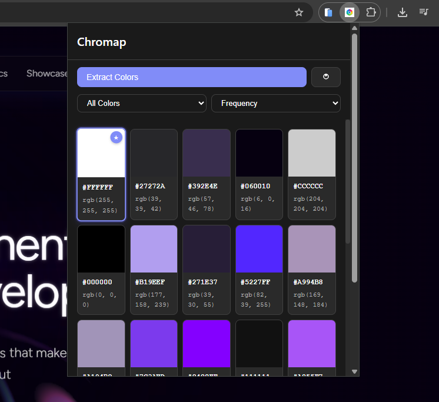

# Chromap - Color Extractor

<div align="center">


**Extract and display all colors from any website**

[](https://opensource.org/licenses/MIT)
[](https://chrome.google.com/webstore)
[](https://github.com/nicenvrro-dev/chromap)

[Features](#features) • [Installation](#installation) • [Usage](#usage) • [Development](#development) • [Contributing](#contributing)

</div>

---

## Overview

Chromap is a powerful Chrome extension that automatically extracts and displays all colors used on any webpage. Perfect for designers, developers, and anyone who wants to understand the color palette of a website.

### Key Features

- 🎨 **Automatic Color Extraction**: Scans entire page DOM for all color values
- 🔍 **Multiple Color Sources**: Background colors, text colors, border colors, box-shadow colors, and gradient colors
- 📐 **Color Format Support**: Hex, RGB/RGBA, HSL/HSLA, and named colors
- 🎯 **Smart Deduplication**: Shows unique colors only with frequency count
- 📋 **Copy to Clipboard**: One-click copy for hex, RGB, or HSL values
- 💾 **Export Options**: Export palette as JSON, CSV, or CSS variables
- 🔄 **Filter & Sort**: Filter by color type, sort by frequency, hue, or brightness
- 🌓 **Dark/Light Mode**: Automatic theme support in popup UI
- ⚡ **Instant Modal**: Click any color to view details immediately
- ✨ **Visual Enhancements**: Hover glow effects, dominant color highlighting, loading animations

## Demo

See Chromap in action! Watch how it extracts colors from any webpage:

<div align="center">


_Extracting colors from a webpage in real-time_

</div>

## Features in Detail

### Color Extraction

- Extracts colors from DOM elements' computed styles
- Parses CSS stylesheets for additional colors
- Extracts colors from gradients (linear, radial, conic)
- Handles transparent and named colors
- Optimized for large pages with element sampling

### User Interface

- **Modern Design**: Clean, minimalist interface
- **Color Grid**: Responsive grid layout with color swatches
- **Color Modal**: Detailed view with hex, RGB, HSL values
- **Hover Effects**: Subtle glow using each color's own tone
- **Dominant Color**: Highlights the most frequent color
- **Loading Animation**: Professional shimmer effect during extraction
- **Copy Feedback**: Visual confirmation when colors are copied

### Export Options

- **JSON**: Structured data format for programmatic use
- **CSV**: Spreadsheet-compatible format
- **CSS Variables**: Ready-to-use CSS custom properties

### Accessibility

- Full keyboard navigation support
- ARIA labels and roles
- Screen reader compatible
- Focus management
- High contrast support

## Installation

### From Chrome Web Store

_(Coming soon)_

### From Source

1. **Clone the repository**

   ```bash
   git clone https://github.com/nicenvrro-dev/chromap.git
   cd chromap
   ```

2. **Load in Chrome**

   - Open Chrome and navigate to `chrome://extensions/`
   - Enable "Developer mode" (toggle in top right)
   - Click "Load unpacked"
   - Select the `chromap` folder
   - The extension icon should appear in your toolbar

3. **Verify Installation**
   - The Chromap icon should appear in your Chrome toolbar
   - Icons are already included in the repository

## Usage

### Basic Usage

1. Navigate to any website
2. Click the Chromap icon in your Chrome toolbar
3. Colors are automatically extracted and displayed
4. Click any color card to view details
5. Copy colors or export the palette

### Advanced Features

#### Filtering Colors

- Use the filter dropdown to show colors by source:
  - **All Colors**: Show all extracted colors
  - **Background**: Only background colors
  - **Text**: Only text/foreground colors
  - **Border**: Only border colors
  - **Shadow**: Only shadow colors
  - **Gradient**: Only gradient colors

#### Sorting Colors

- Sort by:
  - **Frequency**: Most used colors first
  - **Hue**: Colors organized by hue
  - **Brightness**: Light to dark or vice versa

#### Exporting Palettes

1. Click "Export" in the footer
2. Choose format:
   - **JSON**: For developers and tools
   - **CSV**: For spreadsheets
   - **CSS Variables**: For styling

#### Keyboard Shortcuts

- **ESC**: Close modals
- **Enter/Space**: Activate color cards (when focused)
- **Tab**: Navigate between elements

## Screenshots

<div align="center">

### Extension Popup Interface



_Clean, modern interface displaying extracted color palette with HEX and RGB values_

</div>

**Key UI Features:**

- **Color Grid**: Responsive grid layout showing all extracted colors
- **Dominant Color**: Highlighted with star icon and accent border
- **Filter & Sort**: Easy filtering by color type and sorting options
- **Dark Mode**: Automatic theme support for comfortable viewing
- **Hover Effects**: Subtle glow effects on color cards

## Development

### Project Structure

```
chromap/
├── manifest.json          # Extension manifest (Manifest V3)
├── popup/                 # Popup UI
│   ├── popup.html        # Popup HTML structure
│   ├── popup.css         # Popup styles
│   └── popup.js          # Popup logic
├── content/               # Content scripts
│   └── content.js        # Color extraction script
├── background/            # Background service worker
│   └── background.js     # Message passing logic
├── utils/                 # Shared utilities (reference)
│   ├── colorUtils.js     # Color conversion utilities
│   └── exportUtils.js    # Export functionality
└── icons/                 # Extension icons
    ├── icon.svg          # Source SVG
    └── *.png             # Icon assets
```

### Tech Stack

- **Manifest V3**: Latest Chrome extension API
- **Vanilla JavaScript**: No framework dependencies
- **CSS3**: Modern CSS with CSS Variables, Grid, Flexbox
- **Chrome APIs**: `chrome.tabs`, `chrome.scripting`, `chrome.runtime`

### Building

No build step required - this extension uses vanilla JavaScript.

```bash
# Package for Chrome Web Store
npm run package
```

### Testing

1. Load the extension in Chrome (see Installation)
2. Test on various websites:
   - Simple HTML pages
   - Complex SPAs (React, Vue, Angular)
   - Websites with many colors
   - Websites with gradients
3. Test all features:
   - Color extraction
   - Filtering and sorting
   - Copy to clipboard
   - Export functionality
   - Modal interactions
   - Keyboard shortcuts

### Debugging

- **Popup**: Right-click extension icon → "Inspect popup"
- **Content Script**: Open DevTools on the webpage
- **Background**: Go to `chrome://extensions/` → Click "service worker" link

## Contributing

We welcome contributions! Please see [CONTRIBUTING.md](CONTRIBUTING.md) for details.

### How to Contribute

1. Fork the repository
2. Create a feature branch
3. Make your changes
4. Test thoroughly
5. Submit a pull request

See [CONTRIBUTING.md](CONTRIBUTING.md) for detailed guidelines.

## Troubleshooting

### Extension won't load

- Check that all icon files exist in `icons/` folder
- Verify `manifest.json` is valid JSON
- Check browser console for errors

### Colors not extracting

- Ensure you're on a regular webpage (not chrome:// pages)
- Check browser console for errors
- Try refreshing the page and extracting again

### Popup not showing

- Check browser console for errors
- Verify popup.html exists and is accessible
- Try reloading the extension

### Export not working

- Check browser supports File API (modern browsers)
- Verify colors are loaded
- Check browser console for errors

## Browser Support

- ✅ Chrome 88+ (Manifest V3)
- ✅ Edge 88+ (Chromium-based)
- ❌ Firefox (requires Manifest V2 adaptation)
- ❌ Safari (requires different extension format)

## Privacy

Chromap does not collect, store, or transmit any personal data. All color extraction happens locally in your browser. See [PRIVACY_POLICY.md](PRIVACY_POLICY.md) for details.

## License

This project is licensed under the MIT License - see the [LICENSE](LICENSE) file for details.

## Acknowledgments

- Built with vanilla JavaScript
- Inspired by the need for better color extraction tools
- Thanks to all contributors and users

## Roadmap

- [ ] Color contrast checker (WCAG compliance)
- [ ] Extract colors from images
- [ ] Save favorite palettes
- [ ] Export as Adobe Swatch (.ase) format
- [ ] Color history across websites
- [ ] Settings page for preferences
- [ ] Improved gradient color extraction

## Support

- **Issues**: [GitHub Issues](https://github.com/nicenvrro-dev/chromap/issues)
- **Discussions**: [GitHub Discussions](https://github.com/nicenvrro-dev/chromap/discussions)
- **Email**: (Add your email if desired)

## Changelog

See [CHANGELOG.md](CHANGELOG.md) for a detailed list of changes.

---

<div align="center">

Made with ❤️ for designers and developers

[⭐ Star on GitHub](https://github.com/nicenvrro-dev/chromap) • [🐛 Report Bug](https://github.com/nicenvrro-dev/chromap/issues) • [💡 Request Feature](https://github.com/nicenvrro-dev/chromap/issues)

</div>
